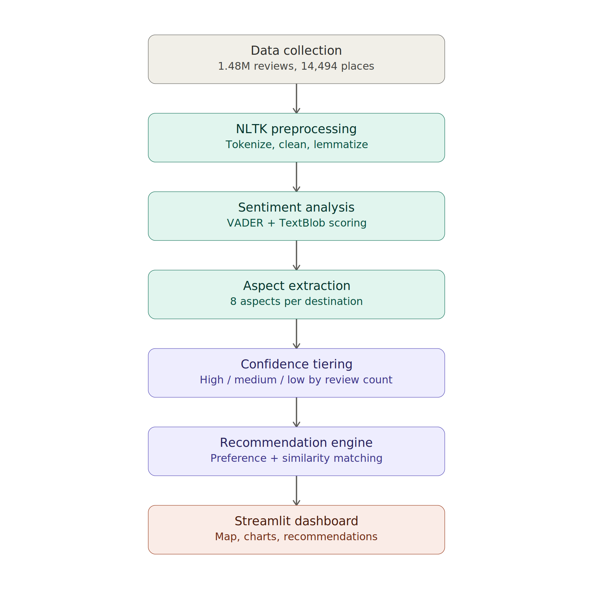

# TravelSense 🧭

**NLP-Based Analysis of Tourist Reviews and Destination Experiences**

TravelSense analyzes 1.48 million real tourist reviews across 14,494 Indian destinations, extracting sentiment and aspect-level insights (cleanliness, food, crowd, safety, etc.), then uses this to power a hybrid recommendation engine — all presented through an interactive Streamlit dashboard with a live map view.

---

## ✨ Features

- **Sentiment Analysis** — VADER + TextBlob, cross-validated (83.6% agreement)
- **Aspect-Based Sentiment** — 8 tracked aspects per destination: cleanliness, staff & service, price & value, food, crowd, accessibility, scenery & experience, safety
- **Confidence Tiering** — every destination tagged High/Medium/Low based on review volume, so recommendations are transparent about reliability
- **Hybrid Recommendation Engine**
  - Preference-based: pick the aspects you care about → ranked destinations
  - Similarity-based: pick a destination you liked → cosine-similarity matches
- **Interactive Map View** — all destinations plotted on a live map of India, colored by sentiment
- **Full-Scale Evaluation** — 88.43% sentiment accuracy validated against star ratings across all 1.48M reviews

## 🏗️ Architecture



Raw reviews flow through NLTK preprocessing, VADER + TextBlob sentiment scoring, and aspect extraction into a confidence-tiered destination profile, which powers both recommenders and the Streamlit dashboard.

## 📊 Results

| Metric | Value |
|---|---|
| Total Reviews | 1,482,466 |
| Destinations | 14,494 |
| Overall Sentiment Accuracy | 88.43% |
| VADER ↔ TextBlob Agreement | 83.6% |

| Class | Precision | Recall | F1-Score |
|---|---|---|---|
| Negative | 0.434 | 0.875 | 0.580 |
| Neutral | 0.847 | 0.440 | 0.579 |
| Positive | 0.936 | 0.961 | 0.948 |

## 🛠️ Tech Stack

- **Data Handling:** Pandas
- **NLP Preprocessing:** NLTK
- **Sentiment Analysis:** VADER, TextBlob
- **Recommendation Engine / Evaluation:** scikit-learn
- **Dashboard:** Streamlit, Matplotlib
- **Map Visualization:** Plotly
- **Geocoding:** geopy (OpenStreetMap Nominatim)

## 📁 Project Structure

```
TravelSense/
├── app.py                  # Streamlit dashboard (main app)
├── full_pipeline.py        # Sentiment + aspect extraction (full dataset)
├── recommender.py          # Preference & similarity recommendation logic
├── evaluate.py             # Evaluation against star-rating ground truth
├── geocode_cities.py       # One-time city geocoding for the map view
├── build_sample_v2.py      # Helper: sample dataset by top places
├── aspect_extraction.py    # Aspect tagging logic
├── architecture.png        # System architecture diagram
├── Screenshot *.png        # Dashboard screenshots
└── README.md
```

> **Note:** Large data files (`Review_db.csv`, processed CSVs) are not included in this repo due to size. See Setup below for how to regenerate them.

## 🚀 Setup

1. Clone this repo:
```
   git clone https://github.com/santhiya1211/TravelSense.git
   cd TravelSense
```

2. Install dependencies:
```
   pip install pandas nltk textblob scikit-learn streamlit matplotlib plotly geopy
```

3. Download NLTK data (one-time):
```python
   import nltk
   nltk.download('punkt')
   nltk.download('stopwords')
   nltk.download('wordnet')
   nltk.download('vader_lexicon')
```

4. Get the dataset — [Indian Places to Visit Reviews Data](https://www.kaggle.com/datasets/ritvik1909/indian-places-to-visit-reviews-data) (Kaggle), and place `Review_db.csv` in your working folder.

5. Run the pipeline in order:
```
   python full_pipeline.py
   python geocode_cities.py
```

6. Launch the dashboard:
```
   python -m streamlit run app.py
```

## 📸 Screenshots


## 🔮 Future Scope

- Fine-tune a transformer model (DistilBERT) for stronger negative/neutral classification
- Named Entity Recognition for specific landmarks and facilities
- Multilingual review support
- Public deployment via Streamlit Community Cloud

## 📄 License

This project was built for academic purposes.
